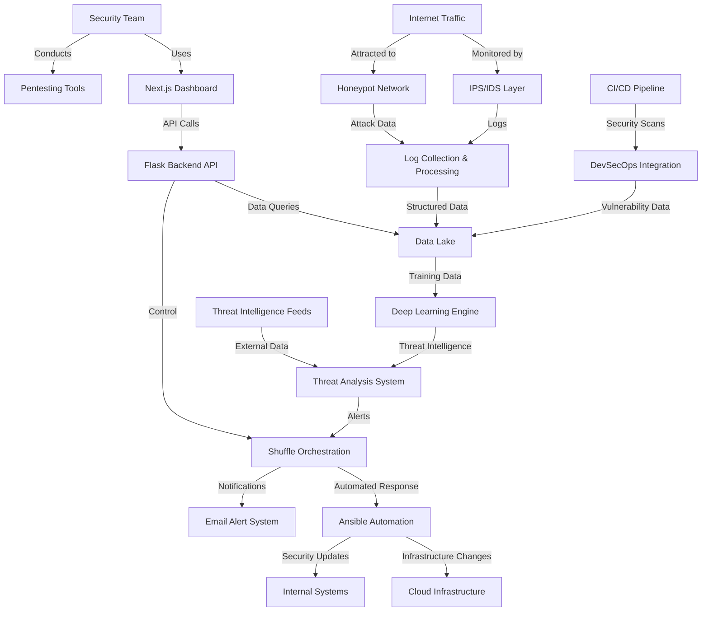

### SecOps Fusion Platform: Advanced Security Operations Center

This comprehensive cybersecurity project integrates multiple security technologies into a unified platform for enterprise security operations.

## Project Overview

The SecOps Fusion Platform is an end-to-end security operations center that combines defensive, offensive, and analytical capabilities. It integrates honeypots, IPS, deep learning, automation, and DevSecOps practices into a cohesive system that can detect, analyze, and respond to threats in real-time.

## Architecture

## Core Components

### 1. Defensive Infrastructure

#### Honeypot Network

- Distributed honeypots (web, SSH, database, IoT)
- Custom honeypot monitoring system
- Attacker behavior analysis
- Automatic signature generation

#### IPS/IDS System

- Network-based intrusion prevention
- Host-based intrusion detection
- Traffic analysis and filtering
- Real-time blocking capabilities

### 2. Intelligence & Analysis

#### Deep Learning Engine

- Multi-model threat detection system:
- Network traffic anomaly detection (LSTM)
- Malware classification (CNN)
- User behavior analysis (Transformer models)
- Attack pattern recognition (Graph Neural Networks)
- Continuous model training and improvement
#### Log Management System

- Centralized log collection
- Real-time log processing and enrichment
- Long-term storage and analysis
- Compliance reporting
### 3. Orchestration & Automation

#### Shuffle Security Orchestration

- Custom security workflows
- Integration with security tools
- Automated investigation processes
- Playbook management
#### Ansible Automation

- Security remediation playbooks
- Infrastructure hardening
- Automated patching
- Configuration management
### 4. User Interface & Reporting

#### Next.js Frontend

- Real-time security dashboard
- Threat visualization
- Investigation management
- Configuration interface
#### Flask Backend API

- RESTful API for all platform functions
- Authentication and authorization
- Data processing and aggregation
- Integration layer between components
### 5. DevSecOps Integration

#### CI/CD Security Pipeline

- Code scanning
- Container security
- Infrastructure as Code validation
- Dependency checking
#### Penetration Testing Tools

- Automated vulnerability scanning
- Scheduled penetration tests
- Exploit validation
- Security posture assessment